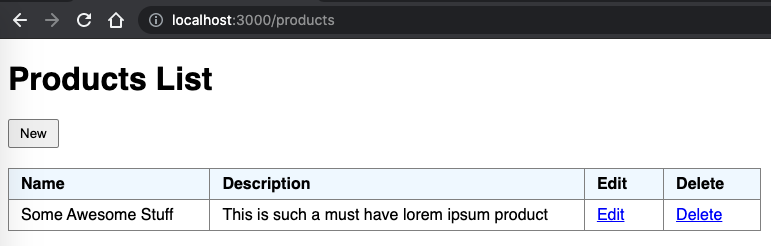

# GraphQL CRUD

A Simple GraphQL CRUD with React & GraphQL.

## Getting started

### API server:

Get from https://github.com/henriqueregatieri/graphql-crud-api & put it to run.

### Client:

Clone this repo, then from command line run:

```
yarn
yarn start
```

App shall be available at:

```
http://localhost:3000
```

## Preview


